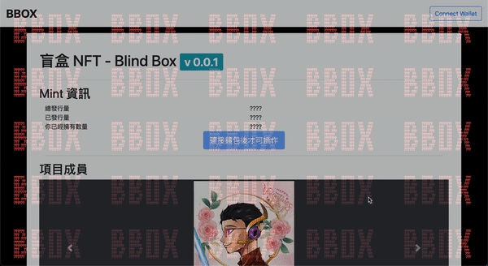
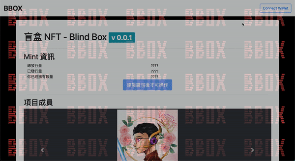

# BBOX-front

## Build Setup

```bash
# install dependencies
$ yarn install

# serve with hot reload at localhost:3000
$ yarn dev

# build for production and launch server
$ yarn build
$ yarn start

# generate static project
$ yarn generate
```

## Demo
- home

- mint

- disconnect


## References

- metamask 官方文件

  - https://docs.metamask.io/guide/ethereum-provider.html
  - https://docs.metamask.io/guide/rpc-api.html

- [nuxt-web3](https://github.com/bl0cknumber/nuxt-web3/blob/master/example/pages/index.vue)

- web3.js

  - [web3.js 官方文件](https://web3js.readthedocs.io/en/v1.7.0/web3-eth-contract.html)
  - [如何取得當前 network id](https://web3js.readthedocs.io/en/v1.2.11/web3-eth-net.html)
  - [NUXT - web3.js - Metamask 實作範例](https://blog.benjaminazoulay.com/connect-to-your-nuxt-app-with-metamask-using-web3js)
  - [web3.js 範例](https://ithelp.ithome.com.tw/articles/10278789)
  - 用 web3.eth.Contract 與 ABI 互動
    - https://betterprogramming.pub/build-your-first-dapp-with-web3-js-9a7306d16a61
    - https://coursetro.com/posts/code/99/Interacting-with-a-Smart-Contract-through-Web3.js-

- ethers.js

  - [用 ethers.Contract 與 ABI 互動](https://javascript.plainenglish.io/fullstack-nft-minting-dapp-using-next-js-hardhat-ethers-js-alchemy-metamask-and-tailwindcss-145e0ef41d26)

- Bootstrap
  - [carousel](https://getbootstrap.com/docs/4.1/components/carousel)
  - [buttons](https://getbootstrap.com/docs/4.0/components/buttons)
